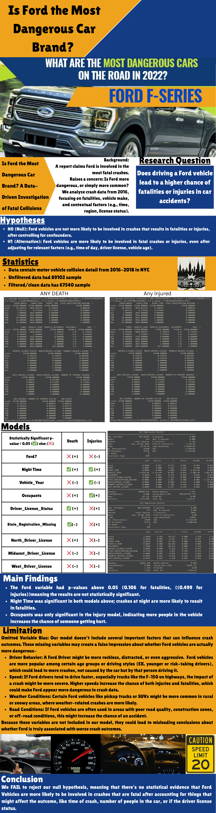

# ⚠️ Disclaimer
This project is for educational purposes only. The analysis is based on a specific subset of data and utilizes linear probability models. Correlation does not imply causation, and results should not be taken as definitive automotive safety advice. 
A one pager has been included with certain information redacted for privacy reasons.


# Ford Vehicle Safety Analysis: Accident Severity & Fatalities

## 📌 Project Overview
This project performs a statistical analysis to investigate the correlation between **Ford vehicles** and the severity of car accidents (fatalities and injuries). The primary research question is:
> *"After controlling for driver and contextual factors (e.g., time of day, vehicle age, license status)    are Ford vehicles more likely to be involved in fatal or injury-causing crashes?  "*

#### Background:
> An online report claims that “The auto maker involved in the most fatal crashes was Ford.” 
  Does this mean that the auto maker “Ford” creates vehicles that have a higher chance of people 
  dying in car accidents, or simply more common? We analyze crash data, focusing on 
  fatalities, vehicle maker, and contextual factors (EX., time, region, license status, etc.)

#### Null Hypothesis (H₀): 
> Ford vehicles are not more likely to be involved in fatal crashes, after 
  adjusting for relevant confounding factors (e.g., time of day, driver license status, vehicle year, 
  number of occupants). 
#### Alternative Hypothesis (H₁): 
> Ford vehicles are more likely to be involved in fatal crashes, even 
  after accounting for those same contextual and driver-related factors. 

**This was developed as a class project using Python & Excel for data cleaning, and statistical modeling.**

## 📂 Dataset
The analysis uses the dataset: `[Cleaned]_Motor_Vehicle_Collisions_Crashes.xlsx`.
* **Sample Size:** Original dataset had over 80,000 rows. After data cleaning, 67,540 rows were used for analysis.
* **Key Variables:** * `FORD?`: Binary variable indicating if the vehicle involved was a Ford.
    * `ANY_DEATH` / `ANY_INJURED`: Outcome variables measuring accident severity.
    * Controls: `NIGHT_TIME`, `VEHICLE_YEAR`, `DRIVER_LICENSE_STATUS`, etc.

## ⚙️ Methodology
**Ordinary Least Squares (OLS) Regression** was used to model the relationship between vehicle make and accident outcomes.

To ensure statistical rigor, we applied **Heteroskedasticity-Consistent (HC0) Standard Errors** (White's Standard Errors) to control for non-constant variance in the error terms. The analysis include:
* **Multiple Regression:** Controlling for confounding variables such as:
    * Time of day (Night vs. Day)
    * Vehicle age and occupancy

## 🛠️ Technologies Used
* **Python 3.x**
* **Pandas** (Data Manipulation)
* **Statsmodels** (Statistical Regression & HC0 Errors)
* **SciPy** (Normality Tests)

## 📊 Results, Limitations & Key Findings
* **Model Findings:** 
  * The Ford variable had p-values above 0.05 (0.106 for fatalities), meaning the results are not statistically significant. 
  * Nighttime was significant; crashes at night are more likely to result in fatalities. 
  * Occupants was only significant, indicating more people in the vehicle increases the chance of someone getting hurt. 

* **Limitations:** 
  * **Omitted Variable Bias:** Our model doesn’t include several important factors that can influence 
    crash outcomes. These missing variables may create a false impression about whether Ford vehicles are actually more dangerous:  
    * **Driver Behavior:** Certain Ford models, especially pickup trucks, may attract specific types of drivers, such as younger, risk-taking, or commercial drivers, whose behaviors increase crash risks.  
    * **Speed (During time of crash):** If Ford drivers tend to drive faster, especially trucks like the F-150(F-150 usually comes with a powerful engine) on highways, the impact of a crash might be more severe, leading to death. Higher speeds increase the chance of both injuries and fatalities, which could make Ford appear more dangerous in crash data. 
    * **Weather Conditions Data:** Certain Ford vehicles, like pickup trucks or SUVs, might be more common in rural or snowy areas, where weather-related crashes are more likely to happen. 
    * **Road Conditions:** If Ford vehicles are often used in areas with poor road quality, construction zones, or off-road conditions, this might also increase the chance of an accident also.  
  * **Model Selection:**
    * Linear Regression was used but typically Linear Regression is best used on continuous data not to predict binary (yes/no or 1/0) outcomes. As the dependent variable only had two options (0 for No Fatality, 1 for Fatality), the model creates a straight line onto data that does not behave linearly. For future imporvement/studies if any, Logistic Regression would be better in determining binary outcome whether Ford vehicle are more likely in a crash compare to other manufacturers. 

* **Conclusion:**
  * Based on this dataset, we fail to reject the null hypothesis, meaning that there was no statistically   significant evidence that Ford vehicles are more likely to be involved in fatal crashes compared to other car brands after controlling facotrs such as time of day, vehicle year, number of occupants, driver license status, etc. 

## 🚀 How to Run This Project & Installation
1.  **Clone the repository:**
    ```bash
    git clone https://github.com/Jimmy-Zhao1/Ford-Case-Study.git
    ```
2.  **Install the dependencies:**
    ```bash
    pip install -r requirements.txt
    ```
3.  **Run the script:**
    ```bash
    python Motor_Vehicle_Collisions_Crashes.py
    ```
    *This will generate an `output.txt` file with the statistical summaries.*

## 🚀 One Pager / Infographic
